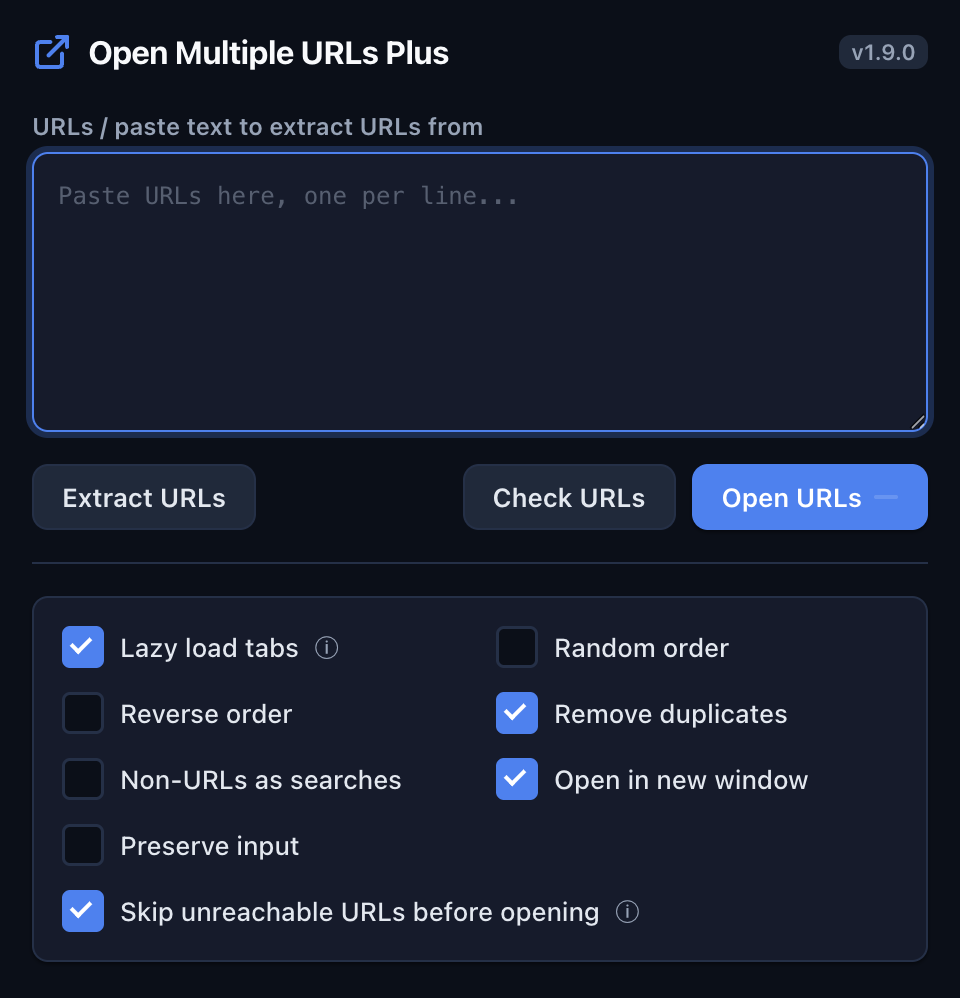

# Open Multiple URLs Plus +

A heavily modified version of [Open Multiple URLs](https://github.com/htrinter/Open-Multiple-URLs) rebuilt for large-scale URL testing workflows. The main use case is checking whether a list of URLs (100+) is alive before opening them as tabs.



---

## Features

### URL Health Check
Paste a list of URLs and click **Check URLs** to probe each one without opening a single tab. Results stream in live with color-coded status badges:

| Badge color | Meaning |
|---|---|
| Green | 2xx / 3xx — server responded OK or redirected |
| Amber | 4xx / 5xx — server is up but the resource is broken (e.g. 404) |
| Gray | Timeout — server did not respond within 8 seconds |
| Red | Dead — connection failed, DNS error, or unreachable host |

After checking you can:
- **Open alive (N)** — opens only the URLs that passed (2xx/3xx)
- **Copy results** — copies a TSV of status, URL, and response time to clipboard

### Skip Unreachable URLs Before Opening
**On by default.** When you click **Open URLs** the extension first probes each URL from the popup (not the background), filters out anything that doesn't respond, then opens only the live ones. Uncheck **Skip unreachable URLs before opening** in the options if you want raw fire-and-forget opening instead.

> This check runs in the popup page rather than the background service worker to avoid corporate/VPN proxy servers returning fake `200 OK` responses for unreachable hosts. HEAD requests that come back 403/405/501 are retried as GET before being trusted — some WAFs block HEAD specifically and would otherwise show a live site as dead.

### Concurrency-Safe Tab Opening
Tabs are opened in a pool of **5 concurrent slots** — fast enough to handle 100+ URLs without overwhelming the browser. Each slot waits up to 10 seconds for a tab to finish loading before taking the next URL.

### Live Progress: Busy Bar + Toolbar Badge
While checking or opening, the action bar collapses to a single status line (`Checking 45/99 · 12 skipped · 8s`) with a **Cancel** button on the right — replaces the normal Extract/Check/Open buttons so the status text never overflows the popup width. The toolbar icon also shows a live `done/total` badge, updated from the background service worker, so progress is visible even after the popup closes (Chrome closes extension popups automatically once they lose focus). Reopen the popup mid-batch and it resyncs to the running state automatically.

### Cancel
A **Cancel** button appears in the busy bar while any operation is in progress (checking or opening). It stops both the popup pre-check phase and any ongoing tab opening in the background, and clears the toolbar badge.

### Extract URLs from Text
Paste arbitrary text — emails, logs, documentation — and click **Extract URLs** to pull out only the URLs. Handles:
- Full URLs with schema (`https://`, `http://`)
- URLs with `www.` prefix
- Bare hostnames with no schema (`venafi-node-01.internal.example.com`)

### Open in New Window
Check **Open in new window** to send all tabs to a fresh browser window instead of your current one. Useful for keeping monitoring or audit sessions separate.

### All Original Options Preserved
| Option | Description |
|---|---|
| Lazy load tabs | Tabs don't load until you select them |
| Random order | Opens URLs in a shuffled order |
| Reverse order | Opens URLs bottom-to-top |
| Remove duplicates | Ignores duplicate lines before opening |
| Non-URLs as searches | Lines without a URL schema are sent as browser searches |
| Preserve input | Keeps the URL list in the textarea after opening |
| Tab group | Assign opened tabs to an existing or new tab group |
| Container | Open tabs in a Firefox container (Firefox only) |

---

## Recommended Workflow for Large URL Lists

```
Paste URLs → Check URLs → Open alive (N)
```

1. Paste your list (one URL per line)
2. Click **Check URLs** — waits for all probes to complete
3. Review the summary (`✓ 87 alive  ! 3 reachable  ⏱ 2 timeout  ✗ 7 dead`)
4. Click **Open alive (87)** — only the working URLs open as tabs

For a one-click version: enable **Skip unreachable URLs before opening** and just click **Open URLs**. The pre-check runs automatically.

---

## URL Format

One URL per line. Supported formats:

```
https://example.com
http://example.com/path/to/page
example.com                          ← gets http:// prepended automatically
subdomain.internal.example.com       ← bare hostnames are handled
api.service.io:8080/health
```

---

## About CSP / Preload Warnings in chrome://extensions

Opening tabs with this extension can make Chrome's extension error log (`chrome://extensions` → **Errors**) fill with things like:

```
Loading the script 'https://example.com/tools/_?_t=index' violates the
following Content Security Policy directive: "script-src 'self'"
Context: browseraction.html
Stack Trace: browseraction.html:0 (anonymous function)
```

or

```
The resource https://example.com/font.woff2 was preloaded using link
preload but not used within a few seconds from the window's load event.
Context: browseraction.html
```

**These are not bugs in this extension.** They're CSP violations and unused-preload warnings thrown by the *opened site's own page* (broken CSP headers, unused `<link rel=preload>` tags, etc). Chrome attributes them to the extension's `Context: browseraction.html` because the tab was created via this extension's `tabs.create()` call, not because the popup's own code did anything. There's no code fix for this — it's how Chrome's error-attribution works for any extension that opens tabs.

How to tell noise from a real bug:
- **Real bug** — stack trace names `popup.js`, `background.js`, or `load-a81c33fb.js` with an actual line number.
- **Noise** — stack trace is `<page>.html:0 (anonymous function)` and the message text references a URL that isn't this extension's own files.

Click **Clear all** on the Errors page before each test run so any new entries are easy to spot and attribute correctly.

---

## Permissions

| Permission | Why it's needed |
|---|---|
| `storage` | Saves your options and URL list between sessions |
| `tabGroups` | Assigns tabs to Chrome tab groups |
| `search` | Opens non-URL lines as browser searches |
| `windows` | Creates a new browser window when "Open in new window" is checked |
| `host_permissions: <all_urls>` | Allows the health check to probe any URL via `fetch()` |

---

## Installation (unpacked)

This extension isn't on the Chrome Web Store — load it as an unpacked extension:

1. Open `chrome://extensions` in a new tab (or Chrome menu → Extensions → Manage Extensions)
2. Turn on **Developer mode** (toggle, top right) — this reveals the Load unpacked / Pack extension / Update buttons
3. Click **Load unpacked**
4. Select this folder (the one containing `manifest.json`)
5. The extension appears in your toolbar — pin it via the puzzle-piece icon if it's hidden in the overflow menu

To reload after code changes: go to `chrome://extensions` and click the refresh icon on the extension's card. Full state (options, saved URL list) persists across reloads via `chrome.storage.local`.

Same steps work in Edge/Brave/other Chromium browsers, just with the extensions page at their equivalent URL (e.g. `edge://extensions`). Official reference: [Chrome for Developers — Hello World extension](https://developer.chrome.com/docs/extensions/get-started/tutorial/hello-world).

---

## Files

```
background.js              Service worker — receives messages, opens tabs, updates toolbar badge
browseraction.html         Popup HTML
popup.js                   All popup logic (health check, URL opening, options, busy UI)
popup.css                  Styles (dark theme)
assets/load-a81c33fb.js    Core tab-opening engine (concurrency pool, new window)
manifest.json              Extension manifest (MV3)
lazyloading.html           Wrapper page for lazy-loaded tabs
```

---

## Based On

[Open Multiple URLs](https://github.com/htrinter/Open-Multiple-URLs) by htrinter — original MIT-licensed extension. This fork rewrites the popup UI, adds URL health checking, pre-open filtering, concurrency-safe batch opening, and a cancel mechanism.
